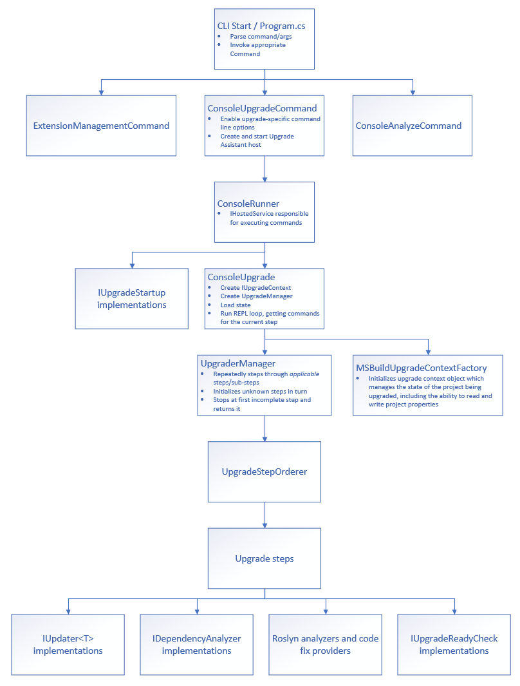
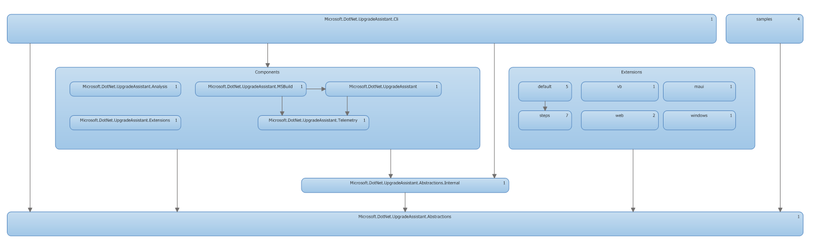

# Contributing

One of the easiest ways for you to contribute is to participate in discussions on GitHub issues. You can also contribute by submitting pull requests with code changes.

## General feedback and discussions?
Start a discussion on the [repository issue tracker](https://github.com/dotnet/upgrade-assistant/issues).

## Bugs and feature requests?
For non-security related bugs, please [log a new issue](https://github.com/dotnet/upgrade-assistant/issues) or simply click [this link](https://github.com/dotnet/upgrade-assistant/issues/new?assignees=&labels=bug&template=20_bug_report.md).

## How to submit a PR

We are always happy to see PRs from community members both for bug fixes as well as new features.
To help you be successful we've put together a few simple rules to follow when you prepare to contribute to our codebase:

**Finding an issue to work on**

  We've created a separate bucket of issues, which would be great candidates for community members to contribute to. We mark these issues with the `help wanted` label. You can find all these issues [here](https://github.com/dotnet/upgrade-assistant/issues?q=is%3Aissue+is%3Aopen+label%3A%22help+wanted%22).
  
Within that set, we have additionally marked issues which are good candidates for first-time contributors. Those do not require too much familiarity with the codebase and are more novice-friendly. Those are marked with `good first issue` label. The full list of such issues can be found [here](https://github.com/dotnet/upgrade-assistant/issues?q=is%3Aissue+is%3Aopen+label%3A%22good+first+issue%22).
  
If there is some other area not included here where you want to contribute to, first open an issue to describe the problem you are trying to solve and state that you're willing to contribute a fix for it. We will then discuss in that issue, if this is an issue we would like addressed and the best approach to solve it.
  
**Before writing code**

  This can save you a lot of time. We've seen PRs where customers solve an issue in a way which either wouldn't fit into upgrade-assistant because of how it's designed or would change upgrade-assistant in a way which is not something we'd like to do. To avoid these situations, we encourage customers to discuss the preferred design with the team first. To do so, file a new `design proposal` issue, link to the issue you'd like to address and provide detailed information about how you'd like to solve a specific problem. We triage issues periodically and it will not take long for a team member to engage with you on that proposal.
  When you get an agreement from our team members that the design proposal you have is solid, then go ahead and prepare the PR.
  To file a design proposal, look for the relevant issue in the `New issue` page or simply click [this link](https://github.com/dotnet/upgrade-assistant/issues/new?assignees=&labels=design-proposal&template=10_design_proposal.md):
  
  
**Before submitting the pull request**

Before submitting a pull request, make sure that it checks the following requirements:

- You find an existing issue with the "help-wanted" label or discuss with the team to agree on adding a new issue with that label
- You post a high-level description of how it will be implemented, and receive a positive acknowledgement from the team before getting too committed to the approach or investing too much effort implementing it
- You add test coverage following existing patterns within the codebase
- Your code matches the existing syntax conventions within the codebase
- Your PR is small, focused, and avoids making unrelated changes
  
If your pull request contains any of the below, it's less likely to be merged:

- Changes that break existing functionality.
- Changes that are only wanted by one person/company. Changes need to benefit a large enough portion of upgrade-assistant users.
- Changes that add entirely new feature areas without prior agreement
- Changes that are mostly about refactoring existing code or code style
- Very large PRs that would take hours to review (remember, we're trying to help lots of people at once). For larger work areas, please discuss with us to find ways of breaking it down into smaller, incremental pieces that can go into separate PRs.

**During pull request review**
A core contributor will review your pull request and provide feedback. To ensure that there is not a large backlog of inactive PRs, the pull request will be marked as stale after two weeks of no activity. After another four days, it will be closed.

## Architecture

To make sure that documentation is fresh, most explanations of Upgrade Assistant's architecture reside in in-code comments which version with the code. Below are the key components to be familiar with in Upgrade Assistant with links to their source files where in-code comments will provide more details on architectural decisions.

### Startup and hosting

- [`Program`](src/cli/Microsoft.DotNet.UpgradeAssistant.Cli/Program.cs) is Upgrade Assistant's entry point. From there, command line arguments are parsed and user commands are executed.
- [`ConsoleUpgradeCommand`](src/cli/Microsoft.DotNet.UpgradeAssistant.Cli/Commands/Upgrade/ConsoleUpgradeCommand.cs) is the command that runs the upgrade workflow. It creates a `Microsoft.Extensions.Hosting` [generic host](https://docs.microsoft.com/dotnet/core/extensions/generic-host) to register and execute upgrade services. All services are resolved from the [dependency injection container](https://docs.microsoft.com/dotnet/core/extensions/dependency-injection) setup by the command, which makes it easy for extensions to register services in addition to those registered by default.
- [`ConsoleUpgrade`](src/cli/Microsoft.DotNet.UpgradeAssistant.Cli/Commands/Upgrade/ConsoleUpgrade.cs) is the `IAppCommand` that actually runs the REPL loop to upgrade the user's project.
- [`IUpgradeStartup`](src/common/Microsoft.DotNet.UpgradeAssistant.Abstractions/IUpgradeStartup.cs) implementations are executed once as Upgrade Assistant starts up to run pre-commands or otherwise configure settings that will be needed by other components as the tool executes. Current built-in startup implementations include:
  - [`MSBuildRegistrationStartup`](src/components/Microsoft.DotNet.UpgradeAssistant.MSBuild/MSBuildRegistrationStartup.cs) which registers the MSBuild instance on the user's computer that will be used while running Upgrade Assistant.
  - [`NuGetCredentialsStartup`](src/components/Microsoft.DotNet.UpgradeAssistant.MSBuild/NuGetCredentialsStartup.cs) configures NuGet credentials according to any NuGet auth extensions present on the user's machine so that authenticated NuGet feeds can be used during Upgrade Assistant's execution.
  - [`ConsoleFirstTimeUserNotifier`](src/cli/Microsoft.DotNet.UpgradeAssistant.Cli/ConsoleFirstTimeUserNotifier.cs) displays one-time messages to users as the tool starts up if they haven't run Upgrade Assistant before.
  - [`UsedCommandTelemetry`](src/cli/Microsoft.DotNet.UpgradeAssistant.Cli/UsedCommandTelemetry.cs) reports anonymous telemetry on the command used to start Upgrade Assistant.

### Core upgrade components

- [`UpgraderManager`](src/components/Microsoft.DotNet.UpgradeAssistant/UpgraderManager.cs) is the central Upgrade Assistant component responsible for managing the list of upgrade steps and progressing through them one at a time.
- [`UpgradeStepOrderer`](src/components/Microsoft.DotNet.UpgradeAssistant/UpgradeStepOrderer.cs) is the service the upgrader manager uses to order steps based on their `DependsOn` and `DependencyOf` properties.

### Upgrade state

- [`IUpgradeContext`](src/common/Microsoft.DotNet.UpgradeAssistant.Abstractions/IUpgradeContext.cs) is the primary type used to store the current state of the upgrade process. It provides access to information about the projects being upgraded and allows callers to query information about the projects or update the projects.
- [`IProject`](src/common/Microsoft.DotNet.UpgradeAssistant.Abstractions/IProject.cs) and [`IProjectFile`](src/common/Microsoft.DotNet.UpgradeAssistant.Abstractions/IProjectFile.cs) abstractions are used for accessing projects in the user's solution. The default implementation of `IUpgradeContext` ([`MSBuildWorkspaceUpgradeContext`](src/components/Microsoft.DotNet.UpgradeAssistant.MSBuild/MSBuildWorkspaceUpgradeContext.cs)) implements the project-related interfaces behind the scenes with MSBuild APIs.
- [`IUpgradeStateManager`](src/common/Microsoft.DotNet.UpgradeAssistant.Abstractions/IUpgradeStateManager.cs) (implemented, by default, by [`FileUpgradeStateFactory`](src/cli/Microsoft.DotNet.UpgradeAssistant.Cli/FileUpgradeStateFactory.cs)) persists select data from the upgrade context to disk until the upgrade is complete. This state can be useful for Upgrade Assistant to start up more quickly but should not be *necessary*.

### Upgrade steps

- [`UpgradeStep`](./src/common/Microsoft.DotNet.UpgradeAssistant.Abstractions/UpgradeStep.cs) is the base type that all upgrade steps derive from. Upgrade steps defined in the default extensions include:
  - [`BackupStep`](src/steps/Microsoft.DotNet.UpgradeAssistant.Steps.Backup/BackupStep.cs) runs early in the upgrade process and backs up the input project or solution to another folder in case the user later wants to roll back to the state the input code was in prior to running Upgrade Assistant.
  - [`EntryPointSelectionStep`](src/steps/Microsoft.DotNet.UpgradeAssistant.Steps.Solution/EntrypointSelectionStep.cs) prompts the user to select which project is the head project in the case of multi-project solutions.
  - [`CurrentProjectSelectionStep`](src/steps/Microsoft.DotNet.UpgradeAssistant.Steps.Solution/CurrentProjectSelectionStep.cs) orders the projects to be upgraded and prompts the user to choose which project to upgrade first in a multi-project solution since most upgrade steps only upgrade a single project at a time.
  - [`TryConvertProjectConverterStep`](src/steps/Microsoft.DotNet.UpgradeAssistant.Steps.ProjectFormat/TryConvertProjectConverterStep.cs) uses the try-convert tool (packaged with Upgrade Assistant at build time) to convert the current project to an SDK-style project and updates package references to use `<PackageReference>` format instead of using packages.config.
  - [`SetTFMStep`](src/steps/Microsoft.DotNet.UpgradeAssistant.Steps.ProjectFormat/SetTFMStep.cs) updates the current project to use an updated .NET Core or .NET Standard TFM based on project properties and the user's preference for LTS, Current, or Preview. More details on TFM selection are given below.
  - [`PackageUpdaterStep`](src/steps/Microsoft.DotNet.UpgradeAssistant.Steps.Packages/PackageUpdaterStep.cs) uses registered [`IDependencyAnalyzer`](src/common/Microsoft.DotNet.UpgradeAssistant.Abstractions/Dependencies/IDependencyAnalyzer.cs) instances to apply upgrades based on the project's dependencies.
    - DependencyAnalzyers are covered in more depth in [extensibility dependency analyzer docs](./docs/extensibility.md#dependency-analyzers).
  - [`PackageUpdaterPreTFMStep`](src/steps/Microsoft.DotNet.UpgradeAssistant.Steps.Packages/PackageUpdaterPreTFMStep.cs) is just like `PackageUpdaterStep` except that it's run prior to updating the project's TFM, so it will remove transitive dependencies but likely won't change any package versions. This step is meant as a way to clean up package references for users who want to modernize their project files without completely upgrading to .NET Core or .NET 5/6.
  - [`TemplateInserterStep`](src/steps/Microsoft.DotNet.UpgradeAssistant.Steps.Templates/TemplateInserterStep.cs) adds template files appropriate for the project type to the project being upgraded if they don't exist yet.
  - [`SourceUpdaterStep`](src/steps/Microsoft.DotNet.UpgradeAssistant.Steps.Source/SourceUpdaterStep.cs) uses Roslyn analyzers and code fix providers to identify code patterns in C# and VB files that will need updated as part of the upgrade process.
  - [`ConfigUpdaterStep`](src/steps/Microsoft.DotNet.UpgradeAssistant.Steps.Configuration/ConfigUpdaterStep.cs) uses registered `IUpdater<ConfigFile>` instances to apply project-level upgrades based on the contents of web.config and app.config files.
    - [`IUpdater<ConfigFile>`](src/common/Microsoft.DotNet.UpgradeAssistant.Abstractions/IUpdater.cs) is covered in more depth in [extensibility docs](docs/extensibility.md#updaters).
  - [`RazorUpdaterStep`](src/extensions/web/Microsoft.DotNet.UpgradeAssistant.Steps.Razor/RazorUpdaterStep.cs) updates Razor views (cshtml files) in the project using registered `IUpdater<RazorCodeDocument>` implementations.
    - [`IUpdater<RazorCodeDocument>`](src/common/Microsoft.DotNet.UpgradeAssistant.Abstractions/IUpdater.cs) is covered in more depth in [extensibility docs](docs/extensibility.md#updaters).
  - [`NextProjectStep`](src/steps/Microsoft.DotNet.UpgradeAssistant.Steps.Solution/NextProjectStep.cs) runs after upgrading a specific projects is complete and clears the current project from the upgrade context. This will cause most project-specific steps to reset their state the next time the UpgraderManager checks their applicability, causing them to run again on the next project the user selects.
  - [`FinalizeSolutionStep`](src/steps/Microsoft.DotNet.UpgradeAssistant.Steps.Solution/FinalizeSolutionStep.cs) is intended to run as the last step of the upgrade process and performs cleanup activities such as deleting the .upgrade-assistant state file.

### Other services

- [`IUpgradeReadyCheck`](src/common/Microsoft.DotNet.UpgradeAssistant.Abstractions/IUpgradeReadyCheck.cs) implementations are used by the `CurrentProjectSelectionStep` to validate that projects are able to be meaningfully upgraded by Upgrade Assistant and can be successfully loaded.
- [Roslyn analyzers and code fix providers](src/extensions/default/analyzers) are used by the `SourceUpdaterStep` and `RazorUpdaterStep` to identify patterns in source code that users will need to update and, if a code fix provider is available, will automatically make those fixes. Extensions can add their own analyzers and code fix providers to extend this functionality.

### TFM selection

- [`ITargetFrameworkSelector`](src/common/Microsoft.DotNet.UpgradeAssistant.Abstractions/ITargetFrameworkSelector.cs) implementations determine the recommended TFM for given input projects. The default implementation ([`TargetFrameworkSelector`](src/components/Microsoft.DotNet.UpgradeAssistant/TargetFramework/TargetFrameworkSelector.cs)) chooses .NET Standard 2.0 whenever possible (since it is the most portable target for modern development) and uses a series of [`ITargetFrameworkSelectorFilter`](src/common/Microsoft.DotNet.UpgradeAssistant.Abstractions/ITargetFrameworkSelectorFilter.cs) implementations to update this baseline until the correct TFM is found. These filters (which can be easily added to by registering additional filters in DI) look at factors like project output type, dependencies' TFMs, and project properties. `ITargetFrameworkSelectorFilter` implementations in the default extensions include:
  - [`ExecutableTargetFrameworkSelectorFilter`](src/components/Microsoft.DotNet.UpgradeAssistant/TargetFramework/ExecutableTargetFrameworkSelectorFilter.cs) ensures that projects built as exes build using an executable .NET target (.NET Core 3.1, .NET 5, or .NET 6, depending on the user's preferences) rather than .NET Standard.
  - [`WebProjectTargetFrameworkSelectorFilter`](src/components/Microsoft.DotNet.UpgradeAssistant/TargetFramework/WebProjectTargetFrameworkSelectorFilter.cs) ensures that web projects build against executable .NET targets since ASP.NET and ASP.NET Core apps should target .NET Core 3.1, .NET 5, or .NET 6 after upgrade rather than .NET Standard.
  - [`DependencyMinimumTargetFrameworkSelectorFilter`](src/components/Microsoft.DotNet.UpgradeAssistant/TargetFramework/DependencyMinimumTargetFrameworkSelectorFilter.cs) ensures the TFM a project is upgraded to is not less than the TFMs of that project's dependencies. So, for example, a project that has dependencies built against .NET 5 must target at least .NET 5 (not 3.1 or netstandard2.0) itself.
  - [`WindowsSdkTargetFrameworkSelectorFilter`](src/components/Microsoft.DotNet.UpgradeAssistant/TargetFramework/WindowsSdkTargetFrameworkSelectorFilter.cs) ensures that projects with Windows-specific dependencies (WinForms, WPF, etc.) use a TFM with the -windows target.
  -[ `MyTypeTargetFrameworkSelectorFilter`](src/extensions/vb/Microsoft.DotNet.UpgradeAssistant.Extensions.VisualBasic/MyTypeTargetFrameworkSelectorFilter.cs) ensures that VB projects using the MyType node upgrade to at least net5.0-windows.

### Extensibility

Upgrade Assistant uses an extension model that makes it possible for add-ons to modify the behavior of existing steps and services or add their own. This is done by allowing extensions to both register services in the tool's dependency injection container and by allowing extension options to be registered which can configure services while also allowing other extensions to modify the options. Upgrade Assistant's extension architecture is covered in detail in dedicated [extensibility documentation](./docs/extensibility.md).

### Diagram

The architectural components described above are shown in this architecture diagram of Upgrade Assistant's logical components:

### Project architecture validation

The architecture of project is enforced with validation diagrams and will be run automatically at build. See the `eng/DependencyValidation` project to update or adjust this diagram. The following project architecture is currently enforced:

To disable validation for a specific project, set `ValidateLayerDiagram=false`. This is done currently for tests as they are not in the diagram.

Steps to add new project for validation :

 - Add the new project as a reference to the DependencyValidation Project
 - Open Class View Window from Architecture Menu
 - Open the UpgradeAssistant.layerdiagram
 - Drag and Drop the new project from Class View to the correct area of the Dependency Diagram.

>Do not ignore the Missing Workloads Installation popup. If you did, check that your VS install has the .NET desktop development workload and the optional Architecture and Analysis Tools component. Look at the documentation for [Dependency Diagrams](https://docs.microsoft.com/en-us/visualstudio/modeling/layer-diagrams-guidelines?view=vs-2019#what-is-a-dependency-diagram)

## Resources to help you get started

Here are some resources to help you get started on how to contribute code or new content.

* Look at the [Contributor documentation](/README.md) to get started on building the source code on your own.
* ["Help wanted" issues](https://github.com/dotnet/upgrade-assistant/labels/help%20wanted) - these issues are up for grabs. Comment on an issue if you want to create a fix.
* ["Good first issue" issues](https://github.com/dotnet/upgrade-assistant/labels/good%20first%20issue) - we think these are a good for newcomers.
* [Best Practices for Roslyn Analyzers and Code Fixers](./docs/roslyn_best_practices.md) - our goal is to build analyzers that are performant and available for both C# and Visual Basic by default.

### Identifying the scale

If you would like to contribute to upgrade-assistant, first identify the scale of what you would like to contribute. If it is small (grammar/spelling or a bug fix) feel free to start working on a fix. If you are submitting a feature or substantial code contribution, please discuss it with the team and ensure it follows the product roadmap. You might also read these two blogs posts on contributing code: [Open Source Contribution Etiquette](http://tirania.org/blog/archive/2010/Dec-31.html) by Miguel de Icaza and [Don't "Push" Your Pull Requests](https://www.igvita.com/2011/12/19/dont-push-your-pull-requests/) by Ilya Grigorik. All code submissions will be rigorously reviewed and tested further by the upgrade-assistant team, and only those that meet an extremely high bar for both quality and design/roadmap appropriateness will be merged into the source.

### Submitting a pull request

You will need to sign a [Contributor License Agreement](https://cla.dotnetfoundation.org/) when submitting your pull request. To complete the Contributor License Agreement (CLA), you will need to follow the instructions provided by the CLA bot when you send the pull request. This needs to only be done once for any .NET Foundation OSS project.

If you don't know what a pull request is read this article: https://help.github.com/articles/using-pull-requests. Make sure the repository can build and all tests pass. Familiarize yourself with the project workflow and our coding conventions. For general coding guidelines, see [here](https://github.com/dotnet/aspnetcore/wiki/Engineering-guidelines#coding-guidelines).

### Tests

[Tests](/tests) in upgrade-assistant follow the following pattern:

- Testing Framework used is [XUnit](https://docs.microsoft.com/en-us/dotnet/core/testing/unit-testing-with-dotnet-test).
- Mocking Framework used is [Moq](https://github.com/Moq/moq4) (with [AutoMock](https://autofaccn.readthedocs.io/en/latest/integration/moq.html)).
- Data generation Framework used is [AutoFixture](https://github.com/AutoFixture/AutoFixture/wiki/Cheat-Sheet).

Tests need to be provided for every bug/feature(except docs or samples) that is completed.

### Feedback

Your pull request will now go through extensive checks by the subject matter experts on our team. Please be patient while upgrade-assistant team gets through it. Update your pull request according to feedback until it is approved by one of the upgrade-assistant team members. Once the PR is approved, one of the upgrade-assistant team members will merge your PR into the repo.

### Dev Environment FAQ
The tool may produce long file paths during build, in order to not run into PathTooLongException either change the LongPathsEnabled setting under registry or build upgrade-assistant from a folder location with a shorter path.

## Code of conduct
See [CODE-OF-CONDUCT.md](./CODE-OF-CONDUCT.md)
