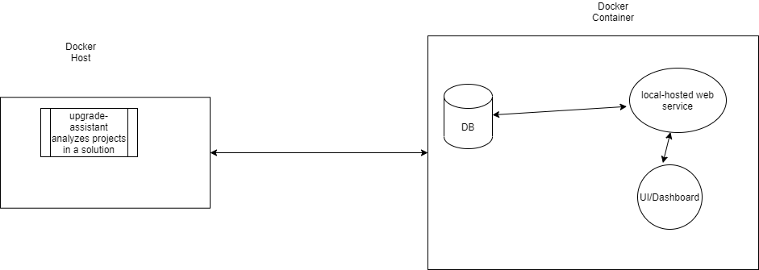

# Overview

The focus of this document is to provide a design overview on pre-upgrade analysis aspect in the move to .NET Core process.

# Design Overview
 Upgrade-Assistant will provide option for user to be able to analyze project dependencies up-front before starting the upgrade process.

 A typical control flow looks like:
 - User downloads and installs upgrade-assitant following instructions [here](../../README.md#Installation).
 - User executes analyze command pointing to a solution/entry-point like ```upgrade-assistant analyze <solution/entry-point>```
 - Upgrade-Assitant process performs analysis on all project dependecies for the solution:
    - Nuget package dependencies : current version being used and what is the target .NET version compatible version to upgrade to.
	 - Loose binaries or assemblies: Determine if there is an available target .NET version compatible nuget packages that contains the content of the assembly or not.
    - Inter-project dependencies : Provide an ordered list of projects to upgrade based on project-to-project dependencies.
    - Surface unsupported API categories: If any of the projects use API categories that are not supported in target .NET version like  WCF server APIs, AppDomain creation, WebForms, etc., surface the information to the user.
 - The analysis information is constructed in a format(XML/JSON/HTML/XLSX) that then the user can consume:
   - By ingesting into a data source to be pulled into data visualization component if they desire.
   - Plug into other user tools, if any.

The existing default in Upgrade-Assistant is "upgrade" mode but once the analyze command is introduced, the user will have to explicitly choose if they would like to ```analyze``` or ```upgrade```. The user will be prompted to make a choice if none is provided. Analyze capabilities will not be a part of the Upgrade command, but the user will be informed in the logs about existence of ```analyze``` command.

 # Implementation Details

 ## NuGet package dependency analysis:
   If a referenced NuGet package in the project isn't compatible with the target .NET version, Upgrade-Assistant already has capabilities built-in to determine the first major version that is compatible to the target .NET version by using existing Nuget APIs. Upgrade-Assistant also already has logic built-in to determine transitive dependencies that needs to be removed while upgrading to .NET Core.

## Loose-Assembly Analysis:
There are scenarios where projects depend on loose-assemblies (GAC, checked-in binaries), ability to determine a path to modernizing the loose-assembly dependencies is helpful. This step will determine if the content of the assembly now exists in a nuget package that then can be added to packagereference for the project. MSFT tooling can provide the capability to "look-up" a compatible nuget package based on the assembly meta-data(name, version, API surface areas used etc.). As a preliminary attempt to integrate capabilities to upgrade-assistant:

- Add code for computing binary hash for identifying assembly <-> NuGet package mapping
- Provide option for users to download a compressed indexed cache of binary hash -> nuget package mapping data on demand if the solution being analyzed has loose-assemblies present.
- The lazy-downloadable cache will be kept up-to-date with regular imports of all publicly available nuget package data from loose assembly DB.

## Inter-Project dependencies:
Upgrade-Assistant has built-in capability to determine inter-project dependencies in a solution and calculate the order in which it is recommended to start upgrade process.

## Surface unsupported API categories:
If any of the projects use API categories that are not supported in target .NET version like  WCF server APIs, AppDomain creation, WebForms, etc., surface the information to the user.
**Out Of Scope** : This step will not provide a detailed unsupported API list, only the categories that could make the scope of the upgrade process large for the customers.

# Analysis for multiple solutions or services:

Customers with a large code base spanning across multiple solutions and services would like to have pre-upgrade analysis for all the solutions, project dependencies between solutions/services (dependency graph) information. In order to support this scenario, upgrade-assistant need to support analysis of multiple solutions / directory containing all the solutions that need to analyzed.



# Data Visualization and Data Storage:
In order to provide a solution for customers wishing to persist analysis results and be able to visualize patterns/history/status of upgrade process, an option for a separate decentralized solution (possibly a docker windows) that contains data storage option, a local-hosted webservice and data visualization component will be provided. 

The typical flow here would look involve executing the upgrade-assistant analyze command on the host machine which then would produce the analysis information mentioned in the above sections in a format that then the user can ingest into the data storage option provide in the decentralized solution.

Alternately customers can also use their own storage solution and ingest analysis data from Upgrade-Assistant into their data storage. 

**Things to keep in mind** :
- Ensure that the output format from Upgrade-Assistant not brick the existing DB schema of customers.
- Backward compatibility especially around breaking changes like introducing new columns, removing existing columns.

Customers can choose to integrate upgrade-assistant analysis to their CI/CD system (AzDO/GH Actions) that then can do the analysis for a solution/service on a specified cadence.

Detailed instructions on how to set up the decentralized solution will be provided via dotnet blog and readme in the repo.

# Implementation Phases:

## Phase I:
- Add analyze command capabilities to upgrade-assistant to support a single solution / entry-point. This is the level of entry-point that is already supported for the upgrade path. 
- Provide an output format (XML/JSON/HTML/XLSX) for the analyzed results.

**Cost** : L

## Phase II: 
- Producing AzDO pipeline tasks/GH actions/etc that could run in the context of a build and produce analysis results that then can be uploaded to AzDO / GH artifacts.
- The task can include steps to execute multiple solutions in a repo.

**Cost** : M (contingent on Phase I completion)

## Phase III:
Add loose assembly analysis capability to upgrade-assistant.
- Loose assembly analysis integration.

**Cost** : L (This is L coz this requires quite a bit of experimental prototyping to know the best way to integrate loose assembly analysis. This effort can happen in parallel to Phase I and Phase II)

## Phase IV:
- Analyze command supports multiple solutions / directory of solutions.
- Output format supports multiple solutions.

**Cost** : M (contingent on Phase I completion)

## Phase V:
A scaled out solution for larger codebases:
- Solution for decentralized data store model 
- Add a visualization component.

One of the possible imlementation methods is using a container like docker.

**Cost** : XL (Contingent on Phase II completion. The cost may come down depending on possible re-use of internal dockerized data storage and visualization solution).

## Phase VI / Future:
- Support for analyzing and / or upgrading a solution from the data visualization component.
- Integrate loose assembly analysis into a modern service with a public end-point that upgrade-assistant / any tool can post a request with computed hash and receive a response from the service.
- Assembly-level dependency analysis between services for dependency graph.
- Explore other push and/or pull models to get the data to the decentralized data store.

