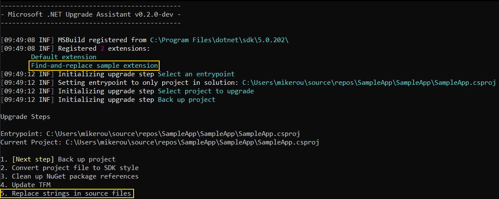
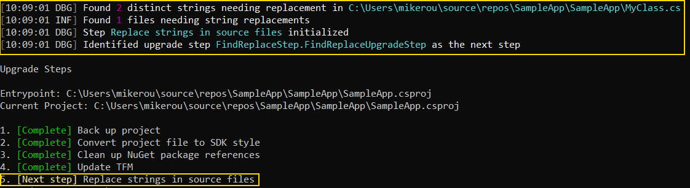
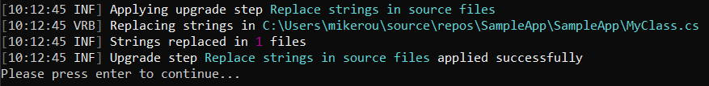

# Upgrade Assistant FindReplace upgrade step sample

This sample demonstrates how to create a custom upgrade step and register it using an `IExtensionServiceProvider`.

This sample adds a simple upgrade step to Upgrade Assistant that finds configured text snippets in source files and replaces them with specified updated text.

*Loading the FindReplaceStep sample extension*

*The FindReplaceStep sample after initialization*

*The FindReplaceStep sample after application*

