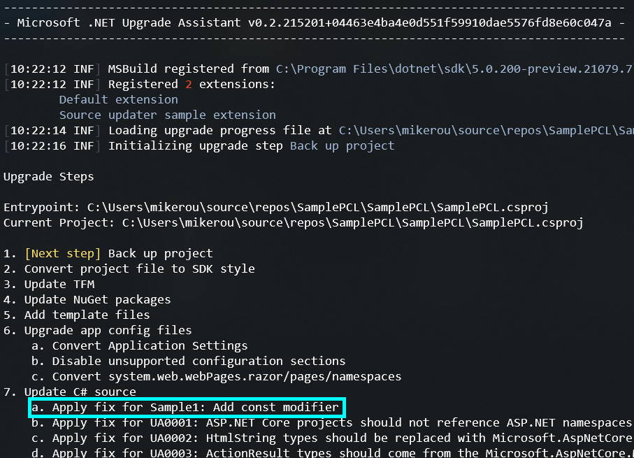

# Upgrade Assistant source updater sample

This sample demonstrates how to add custom source updates to Upgrade Assistant using Roslyn analyzers and code fix providers. You can learn how to create Roslyn analyzers and code fix providers in [Roslyn documentation](https://docs.microsoft.com/visualstudio/extensibility/getting-started-with-roslyn-analyzers).

While running, Upgrade Assistant's source updater step will look in the dependency injection container for any analyzers or code fix providers. It then creates sub-steps for each analyzers/code fix provider pair it finds. So, extensions (like this one) can add their own analyzers and code fix providers and register them for use with an `IExtensionServiceProvider`.

